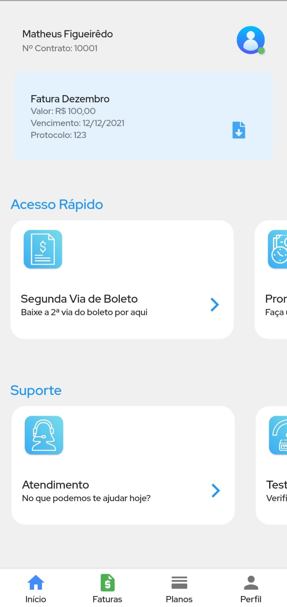

# Aplicativo Para Provedores de Internet

## Objetivo

Fornecer ao cliente do provedor as funcionalidades disponíveis no sistema de gerenciamento do provedor.

## Funcionalidades
  - Efetuar Login :white_check_mark:
  - Visualizar 2ª via de Boleto :white_check_mark:
  - Visualizar Faturas (Atrasadas, Em Aberto e Pagas) :white_check_mark:
  - Efetuar Teste de Velocidade de Internet :white_check_mark:
  - Realizar Promessa de Pagamento :white_check_mark:
  - Baixar Faturas e 2ª via de Boleto :white_check_mark:

## Tecnologias
  - API
  - Flutter
  - Flutter Modular
  - Mobx
  - Slidy

## Packages Utilizados
  - Dio
  - Flutter Mobx
  - Flutter Shimmer
  - Lottie
  - Hive
  - Path Provider
  - Webview Flutter
  - Badges
  - Flutter Downloader
  - Custom Navigator Bar

## Telas

#### Login Page

#### Home Page

## Credits

Developer with ❤️ by [Matheus Figueirêdo](https://www.linkedin.com/in/matheus-figueirêdo-2b1611150/)

